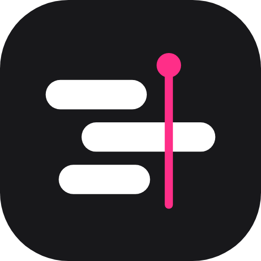
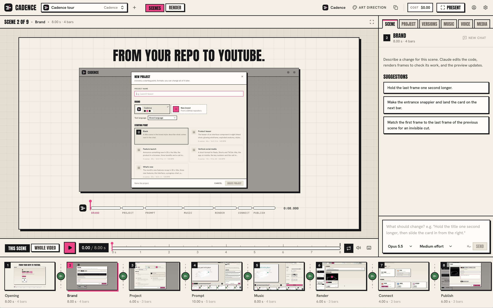

<p align="center">
  
</p>

<h1 align="center">Cadence</h1>

<p align="center">A local, prompt-driven motion design studio for marketing videos, for one brand or several.</p>

<p align="center">
  
  
  
  
  
  
  
  
  
  <a href="LICENSE"></a>
</p>

<p align="center">
  
</p>

A video is a sequence of scenes, and each scene is a React component that draws one frame for a time `t`. You describe
what you want in a chat, down to the millisecond. Claude edits the scene, renders frames to check its work, and the
preview updates. The music sets the grid: cuts and highlights land on beats and bars. Each scene can start on the exact
last frame of the previous one, so the cuts disappear. You then export to MP4, in 16:9, 9:16, 1:1 or 4:5.

This is the method Caleb Porzio showed with [his video of the Flux Card](https://x.com/calebporzio/status/2104937926593487309),
plus what several brands and formats need.

## Requirements

Cadence runs locally, on macOS or Linux (on Windows, inside WSL 2): each teammate installs it on their own machine, with
their own Claude account.

Required:

- Node.js 22.12 or later.
- Git, to clone Cadence and to build a brand from a repository.
- ffmpeg with libx264 and aac, for the MP4 export and the music analysis.
- [Claude Code](https://code.claude.com), signed in to your Claude account: Cadence uses your subscription, there is no
  API key to set up.
- Chrome or Chromium for the editor: renders go through Chromium, so the preview matches the MP4.

Depending on what you do:

- `gh` or `glab` signed in, to list your GitHub or GitLab repositories when you build a brand.
- The keys of the team's apps to publish to YouTube, LinkedIn, Instagram or TikTok (see
  [Publishing to networks](#publishing-to-networks)).
- [Piper](https://github.com/OHF-Voice/piper1-gpl) for voice-overs: `pipx install piper-tts` (Python 3.9 or later), see
  [Voice-over](#voice-over).

### macOS

With [Homebrew](https://brew.sh), which also installs Git (the Xcode command line tools):

```bash
brew install node ffmpeg gh glab
curl -fsSL https://claude.ai/install.sh | bash   # Claude Code
claude                                           # then /login, once
gh auth login                                    # GitHub, for brands built from a repository
glab auth login                                  # GitLab, same
```

### Linux

Checked on Debian 12 and Ubuntu 24.04, with apt:

```bash
sudo apt install ffmpeg git curl
curl -o- https://raw.githubusercontent.com/nvm-sh/nvm/v0.40.8/install.sh | bash   # Node.js: apt's is too old
nvm install 22                                   # in a new terminal
curl -fsSL https://claude.ai/install.sh | bash   # Claude Code, in ~/.local/bin
claude                                           # then /login, once
```

For `gh` and `glab`: `sudo apt install gh glab` on Ubuntu 24.04, otherwise their install pages
([gh](https://github.com/cli/cli/blob/trunk/docs/install_linux.md), [glab](https://docs.gitlab.com/cli/)). Then
`gh auth login` and `glab auth login`. On another distribution, install the same tools with its package manager:
`npm run doctor` tells you what is missing.

## Installation

```bash
git clone https://github.com/mckenziearts/cadence.git
cd cadence
npm ci --ignore-scripts   # exact versions from package-lock, no install script runs
npm run setup             # downloads the headless Chromium that renders frames (once)
npm run doctor            # checks Node, ffmpeg, Chromium, Claude Code and the ports
npm start                 # then open http://127.0.0.1:5310
```

On Linux, run `npm run setup -- --with-deps` instead: it also installs the system libraries Chromium needs (with sudo,
on Debian and Ubuntu).

Always install with `npm ci --ignore-scripts`, never `npm install`: a compromised package can run code at install
time. The repository's `.npmrc` blocks those scripts too, and refuses a Node.js older than 22.12.

Default ports: 5310 for the editor, 5311 for frames. To change them: `npm start -- --port 5410 --frame-port 5411`.

After a `git pull`, run `npm ci --ignore-scripts` again if `package-lock.json` changed. Then restart Cadence (Ctrl+C,
then `npm start`) when no Claude answer and no brand build is running, and reload the page: the server does not reload
its own code.

## Language

The interface exists in French and English. On first launch, the editor takes your browser's language; change it in
Settings, under Language. Cadence's messages and Claude's answers follow the same setting. The command line follows it
too, or your terminal's language before you first open the editor (`CADENCE_LANGUAGE=en` or `fr` forces it). The
language of a video's on-screen text is a separate setting of each project.

## Making a video

1. **Create the project.** Pick the brand, a campaign (for example "Product teaser", which follows the structure of
   Caleb's video), the formats and the language of the on-screen text (the brand's by default). The brand's art
   direction is copied into the project.
2. **Lay down the music first.** Drop an audio file anywhere in the editor. Cadence detects the tempo, the beats, the
   bars and the phrases. Check the BPM: if the downbeat is off, move it one beat earlier or later. Then set the cuts:
   for a campaign, "Keep bars" keeps the number of bars of each scene and puts the cuts on the track's real downbeats.
   Think in bars: at 120 BPM, a bar lasts 2 s. Durations can be typed in bars too ("2 bars"); the label turns orange
   when a cut falls off a bar.
3. **Write the voice-over, if any.** In Voice, give each scene its text: Cadence speaks it and shows when each sentence
   starts and ends, so the scenes can be timed to it (see [Voice-over](#voice-over)).
4. **Give references.** In Media, capture the product's pages (desktop or mobile). Claude reads these captures to rebuild
   the interface in code, sharp at every size.
5. **Scene by scene.** Select a scene, place the playhead and ask for a precise change. The playhead position goes with
   the message: "here" and "from now on" make sense. Examples:
   - "Hold the title one more second, then slide the card in from the right."
   - "Land the card exactly on the next downbeat."
   - "Start this scene on the last frame of the previous one, so the cut is invisible."
   - "Zoom into the bottom right corner of the card and annotate the radii 12 and 16."
6. **Check the cuts.** The badges between scenes give the share of pixels that change at each cut, at full resolution
   and in every format of the project: below 0.05%, the cut is invisible.
7. **Present, then render.** Pick the formats, the quality (Draft, Standard, Master) and, if needed, 2× for 4K.
8. **Publish.** On the Render page, "Publish" sends an exported video to YouTube, LinkedIn, Instagram or TikTok (see
   [Publishing to networks](#publishing-to-networks)).

Everything is versioned: creating the project, each exchange with Claude and each alignment of the cuts make a version,
and restoring a version makes a new one. While Claude is answering, restoring or deleting is blocked: stop the answer
first. Nothing is lost.

To delete a project, hover its card on the home page and confirm: its folder goes to `projects/.trash/`, where you can
get it back. This is blocked during a Claude answer or a render of the project.

To delete an exported video, click the bin on its card on the Render page and confirm: the MP4 goes to the project's
`.cadence/trash/`. What you published stays online. This is blocked while the video is being sent to a network.

## Publishing to networks

On the Render page, **Publish** sends an exported video to a network: pick its tab, then fill in what it asks for. The
upload goes on in the background: the video's card follows its progress, then keeps the link
(`projects/<id>/.cadence/publications.json`).

Accounts are connected in your **Profile** (the icon at the top right, next to Settings). Each network needs one
developer app for the whole team: the team admin creates it once, then shares its keys with the team outside the
repository. Each teammate pastes them in their Profile (**Set up** on the network's card) and connects their own
account; the setup steps are in that dialog too. Keys and connections stay in `.cadence/accounts.json`, which only your
user account can read.

| Network | What Cadence sends | Connection | What the app needs |
| --- | --- | --- | --- |
| YouTube | a video, or a Short (9:16, 3 min or less) | renewed on its own | the YouTube audit, else videos stay private |
| LinkedIn | a video post on your own profile | 60 days, then connect again | nothing to review |
| Instagram | a Reel on a professional account linked to a Facebook Page | about 60 days, then connect again | teammates added as testers |
| TikTok | a draft in your TikTok app, where you post it | renewed on its own for a year | teammates added as Sandbox target users |

### YouTube

1. On [console.cloud.google.com](https://console.cloud.google.com/), create a project and enable "YouTube Data API v3".
2. OAuth consent screen: "External" user type, then "Publish app". In "Testing" mode, Google cuts the connection after
   7 days.
3. Credentials: create an "OAuth client ID" of type "Desktop app".
4. In the Profile, **Set up** on the YouTube card: paste the client ID and the client secret. Then **Connect the
   channel**: Google opens a tab to ask for your consent.
5. Request the [YouTube audit](https://support.google.com/youtube/contact/yt_api_form) of the Google project, free:
   until then, YouTube keeps videos uploaded through the API private, whatever visibility you choose.

The Google project may send 100 videos a day.

### LinkedIn

Cadence posts the video on the connected person's own profile, through two self-serve products: nothing goes through
LinkedIn's review.

1. On [linkedin.com/developers](https://www.linkedin.com/developers/apps/new), create an app linked to the team's
   LinkedIn Page (the app stays tied to it). If the Settings tab shows "Verify", a super admin of the Page approves it.
2. Products: "Request access" on "Share on LinkedIn" and on "Sign In with LinkedIn using OpenID Connect".
3. Auth: under "Authorized redirect URLs for your app", add `http://localhost:5310/oauth/linkedin/callback`, plus one
   line for each other port a teammate runs Cadence on: LinkedIn needs the exact address.
4. Auth: copy the Client ID and the Primary Client Secret. When someone leaves the team, generate a new secret, delete
   the old one and send the new one.

In **Publish**, the LinkedIn tab asks for the post text (required, 3000 characters, `#word` becomes a hashtag) and
"Connections" or "Public". Cadence uploads the video, waits until LinkedIn has processed it (15 minutes at most, else
nothing is posted), then posts it and keeps the link.

- The connection lasts 60 days and cannot be renewed: when it ends, the next publication fails and the card offers to
  connect again. To renew it earlier, disconnect then connect.
- No draft, no scheduling, no private visibility: post the first test to "Connections" and delete it on linkedin.com.
- Videos: 3 seconds to 30 minutes, 75 KB to 500 MB. Quotas: 150 requests per member and 100,000 per app each day.
- Disconnecting forgets the token on this machine; LinkedIn has no API to revoke it (Settings & Privacy, Data
  privacy, "Permitted services" does).
- Posting to a company Page needs LinkedIn's Community Management API, which Cadence does not use.
- Cadence calls LinkedIn's API version 202609, served until September 15, 2027: Cadence needs an update after that.

### Instagram

Cadence publishes Reels through the Instagram API with Facebook Login, the only Instagram API that takes a video sent
from your machine. Each Instagram account must be a professional account (Business or Creator) linked to a Facebook
Page the person connecting manages.

1. On [developers.facebook.com](https://developers.facebook.com/apps/creation/), create an app with the "Manage
   messaging & content on Instagram" use case. At the Business step, choose "I don't want to connect a business
   portfolio yet".
2. In that use case, choose "API setup with Facebook login" (not Instagram login), then "Add all required
   permissions".
3. App roles: add each teammate's Facebook account as a Tester; each one accepts on
   [developers.facebook.com/requests](https://developers.facebook.com/requests/).
4. Leave the app in development mode, without App Review: its testers can publish. In development mode, Meta accepts
   the return address `http://localhost:5310/oauth/instagram/callback` without listing it.
5. App settings, Basic: copy the App ID and the App secret.

When connecting, keep every permission and select the Page and its Instagram account: Cadence publishes to the
Instagram account it found at connection, which the card shows. In **Publish**, the Instagram tab takes a caption
(2200 characters); the Reel goes public right away.

- The connection lasts about 60 days, then Cadence asks you to connect again.
- Videos: 3 s to 15 min, 300 MB at most, 1920 px wide at most, 23 to 60 frames per second: a 4K export is refused.
  9:16 avoids cropping.
- Instagram limits API posts per account over 24 hours (50 to 100, depending on Meta's pages).
- A Page that asks for Page Publishing Authorization or two-factor authentication blocks publishing until its owner
  completes it.

### TikTok

TikTok receives the video as a draft in the person's TikTok app, where they write the caption, choose who can watch it
and post it. Posting straight to a profile needs TikTok's Direct Post audit, which turns down tools for a team's own
accounts: the app stays in Sandbox, which needs no review.

1. On [developers.tiktok.com](https://developers.tiktok.com/apps), open "Manage apps", "Connect an app", then switch
   the toggle next to its name to "Sandbox" and create one.
2. App details: an icon, a category, a description and, under Platforms, "Desktop" with the team's website.
3. Products: add "Login Kit" and "Content Posting API" (Direct Post off). In Login Kit, Desktop platform, add
   `http://127.0.0.1:*/oauth/tiktok/callback` as a redirect URI (the `*` covers every port).
4. Scopes: keep `user.info.basic`, add `video.upload`, then "Apply changes".
5. Sandbox settings, "Target users": "Add account" for each teammate, who signs in with their TikTok account (10 at
   most).
6. With the toggle still on Sandbox, copy the Client key and the Client secret.

- The connection renews itself for a year, then you connect again.
- TikTok does not say whether a draft from a Sandbox app can be posted publicly: try one first. If the video stays
  private, make the account public, then switch the video to "Everyone".
- 5 pending drafts per account in 24 hours, 6 uploads per minute. Videos: 4 GB and 10 minutes at most; most accounts
  post up to 3 minutes. 9:16 shows best.

## Models and cost

- **Opus 5.5** to create a scene. It is Caleb's model.
- **Sonnet 5.5** for quick edits.
- **Haiku 4.5** for tiny fixes.
- **Fable 5.1** is the most powerful, but costs 2.5 times the price of Opus.

The effort level goes from low to max. Each exchange shows its cost as an API equivalent; with the subscription, it
counts against your Claude quota. The top bar adds up the chats of the open project; your Profile adds up every
exchange Cadence started, brand builds included, since the first one it counted. Work done in a terminal is not
counted. A video at Caleb's level takes dozens of exchanges per scene.

## Brands

Each brand is a `brands/<id>/` folder:

| File | Role |
| --- | --- |
| `brand.json` | colors, fonts, radii, logo, tone |
| `theme.css` | Tailwind theme and fonts loaded in the scenes |
| `index.tsx` | the kit: logo, interface components (Card, Button, Input and others) and "extras" of the product |
| `art-direction.md` | default art direction of new projects |
| `KIT.md` | notes for Claude: which component for which use, the product's real copy |

Cadence ships one brand, `cadence`: neutral, the default, and the starting point of every new brand. The others are
built in the app (below) or copied from a teammate, and stay on each machine: like `projects/`, `brands/` is
gitignored, except `cadence`.

Every brand exposes the same interface (`src/shared/brandKit.ts`): a scene template written once works for all of them.
To add a brand, copy `brands/cadence/` and take the product's colors, fonts and real components from its current
version. `npm test` checks that every font a brand names is loaded.

To delete a brand, hover its card in "New project" and confirm, or use "Delete brand" at the end of a build. Its folder
goes to `.cadence/trash/brands/`. The `cadence` brand stays: new brands start from it. A brand used by projects waits
until you delete those projects or change their brand. To bring a brand back, move its folder from
`.cadence/trash/brands/` to `brands/`, under its id.

### From a GitHub or GitLab repository

In "New project", the **New brand** card lists your GitHub and GitLab repositories: the ones `gh` and `glab` see, the
command line tools signed in on your machine (see [Requirements](#requirements)). Your Profile shows which account each
one uses. You can also paste the address of a github.com or gitlab.com repository, nested groups included. Cadence
copies it with your machine's Git access, without keeping a token, then Claude turns a copy of the neutral kit into the
product's kit: colors, fonts, logo, components and extras, taken from its code. Google fonts that Cadence lacks are
downloaded into the brand's `fonts/` folder.

Before listing the brand, Cadence checks it: its files, then the render of each component on the kit sheet. If a
problem remains, Claude gets one fix; otherwise the build fails and the folder is deleted.

- Expect several minutes and a long job for Claude: the cost shows at the end.
- You can close the window: the build goes on, and its badge at the top of the screen shows the current step, then the
  result until you open it.
- Claude reads the repository's code: for a client's repository, ask for their consent.
- The new brand is a `brands/<id>/` folder like the others: copy it to a teammate's `brands/` to share it.

## Scene templates and campaigns

`templates/scenes/<id>/` holds 17 reusable scenes, in the 4 formats and for every brand:

- **Inspired by Caleb's video:**
  - `wireframe-glow`: glowing 3D wireframe on a black background;
  - `exploded-anatomy`: exploded view with callouts;
  - `variant-pills`: variants, one per beat;
  - `surface-grid`: surfaces and backgrounds;
  - `zoom-annotate`: camera zoom and geometric annotations;
  - `cursor-demo`: cursor, typing, hover;
  - `full-bleed`: full-frame image;
  - `logo-build`: the logo building itself.
- **The others:** `title-reveal`, `feature-list`, `stat-counters`, `chart-draw`, `phone-showcase`, `browser-showcase`,
  `code-typing`, `quote-testimonial`, `cta-end`.

`templates/projects/<id>/` holds the campaigns: sequences of scenes with their lengths in bars.

| Campaign | Content | Length | Formats |
| --- | --- | --- | --- |
| `teaser-produit` | the structure of Caleb's video | 46 s at 145 BPM | 16:9 and 9:16 |
| `lancement-fonctionnalite` | a feature launch | 20 s | 16:9, 9:16 and 1:1 |
| `reseaux-sociaux-vertical` | a social media format | 15 s | 9:16 and 4:5 |
| `nouveautes` | a changelog | 30 s | 16:9 and 1:1 |

Each campaign plays with invisible cuts, checked below 0.05%. The writing guide is in `templates/README.md`.

## Music and rights

Only use music whose license covers social networks and advertising. Never reuse the track of another video. The
analysis assumes 3 or 4 beats per bar. 6/8 is set by hand.

## Voice-over

Each scene can have a voice-over: in the **Voice** tab, type what the voice says over the scene and when it starts.
Cadence speaks it with [Piper](https://github.com/OHF-Voice/piper1-gpl), on your machine: the text never leaves it. If
you have an [ElevenLabs](https://elevenlabs.io) account, it can speak it with an ElevenLabs voice instead (see below).
The preview plays the voice with the picture, the music goes down while it speaks (to the level set under **Music under**),
and the MP4 holds the same mix. In a chat, Claude can write a scene's voice-over and time the animations to its
sentences.

Install Piper once, then restart Cadence (`npm run doctor` tells you whether it finds it):

```bash
brew install pipx        # macOS; Debian/Ubuntu: sudo apt install pipx
pipx install piper-tts
```

The first voice-over downloads its voice (about 60 MB) into `.cadence/voices/`, from the **Download the voice** button.
The video's language picks the default voice; another one is a click away in the same tab.

| Voice | Accent | License | In a video that sells something |
| --- | --- | --- | --- |
| Siwis (French default) | France | CC-BY 4.0 | yes, credit the voice in the description |
| Gilles | France | CC0 | yes |
| MLS 1840 | France | CC-BY 4.0 | yes, credit the voice in the description |
| Joe (English default) | US | CC0 | yes |
| Kristin, LJSpeech, Norman | US | public domain | yes |
| Cori | UK | public domain | yes |
| Alba | UK | CC-BY 4.0 | yes, credit the voice in the description |
| Lessac | US | Blizzard 2013, research only | no |
| Ryan | US | CC BY-NC-SA 4.0 | no |

Piper's own documentation presents it as made for personal use and research. Its code license (GPL-3.0) does not
forbid other uses, but each voice keeps the license of the recordings it learned from: the Voice tab shows it, and
flags the two voices that are not for commercial use. Cadence runs Piper as a separate program and never ships it.

To use ElevenLabs, paste an API key from your ElevenLabs account
([API keys](https://elevenlabs.io/app/settings/api-keys)) in the **Voice-over** section of the Profile, then choose
ElevenLabs in a project's Voice tab. Once the key is saved, the same Profile card picks the voice and model new projects
start with: it goes into a project's `project.json` when the project is created, and a later change never touches the
projects already made. Without a choice (the default), new projects start with Piper. Then:

- The text of each sentence goes to ElevenLabs, and every sentence spoken is billed on your account. That is why
  Cadence never speaks with ElevenLabs on its own while you type: it speaks on the **Generate** button, on export, or
  when Claude sets a voice-over.
- ElevenLabs' free plan is for non-commercial use: a video that sells something needs a paid plan.
- The key stays in `.cadence/elevenlabs.json`, readable by your user account only: never sent to the browser, never in
  a project, out of Claude Code's reach. **Remove the key** in the Profile deletes it, and new projects start with Piper
  again; the ones already set on ElevenLabs keep their voice and ask for a key.
- Voices come from your ElevenLabs library (the first 100), and they speak French and English alike. Speed goes from
  0.7 to 1.2.

- Sentences are spoken one by one and cached in `projects/<id>/.cadence/voice-over/`: changing a sentence only speaks
  that one again, and moving a scene or its start speaks nothing again.
- When a voice-over fails, the Voice tab keeps its message, after a reload too, and each scene left without its voice gets a
  **Generate** button that tries again. A spoken scene has a **Listen** button that plays the preview from where its
  voice starts.
- Timing is per sentence, not per word. A sentence can run past the end of its scene into the next one, and the Voice
  tab says so: lengthen the scene (or shorten the text).
- No subtitles yet: the on-screen text is whatever the scenes draw.

## Command line

```bash
npm run cadence -- list
npm run cadence -- new "Back to school" --brand cadence --template reseaux-sociaux-vertical
npm run cadence -- render back-to-school --formats 9:16,4:5 --quality standard
npm run cadence -- analyze ~/Music/track.wav
npm run cadence -- soundtracks   # rebuilds the ambient tracks of the Music panel
npm run cadence -- mcp           # plugs a terminal Claude Code session into Cadence
```

## Using Claude Code in the terminal

With Cadence running, `npm run cadence -- mcp` prints the `claude mcp add` command to run. Then start `claude` in
`projects/`: the same tools (render frames, check the cuts, set durations) are there, and `projects/CLAUDE.md` explains
the scene contract.

## Security

- **Local access only.** Cadence listens on 127.0.0.1 only. The API refuses other hosts and requests from other sites,
  thanks to a token unique to each start.
- **Isolated scene code.** Scenes run on another origin, with no access to the API. Their security policy forbids any
  network call, and render pages also block every way out (workers, WebRTC, windows). Reference captures refuse
  reserved addresses and Cadence itself.
- **Restricted agent.** Claude has no shell and no web access. In a scene chat, it can only edit that scene's file. Its
  MCP tools go through a token valid for a single exchange.
- **Network accounts.** App keys and connections stay in `.cadence/accounts.json`, readable by your user account only:
  never sent to the browser, out of Claude Code's reach. The return from a network only accepts a single-use state,
  valid 10 minutes, that the editor asked for. The ElevenLabs key gets the same treatment in `.cadence/elevenlabs.json`.
  Codex's sandbox limits what it writes, not what it reads: with Codex as the assistant, both files are within its reach.

Never expose it on a network.

## Troubleshooting

- **Something does not work**: `npm run doctor` tells you what is missing and how to fix it.
- **"Claude Code is not logged in"**: run `claude` in a terminal, then `/login`.
- **A scene shows a red error**: click "Ask Claude to fix it", or restore the previous version.
- **Port already in use**: `npm start -- --port <p> --frame-port <p+1>`.
- **After an update, the Profile shows no networks, or "gh is not responding"**: Cadence still runs the old code.
  Restart it (Ctrl+C, then `npm start`) and reload the page.
- **YouTube keeps the video private**: the Google project has not passed the YouTube audit yet.
- **"The YouTube connection expired"**: the consent screen stayed in "Testing" (7 days), or access was removed in the
  Google account. Connect the channel again in the Profile.
- **A network asks you to connect again**: LinkedIn and Instagram connections last 60 days.
- **No voice-over, "Piper not found"**: install it (`pipx install piper-tts`), check that `piper --help` answers in a new
  terminal, then restart Cadence. Elsewhere than on your PATH, give its path in `PIPER_PATH`.
- **Piper fails with "phontab: No such file or directory"**: its install path is too long for espeak-ng (about 160
  characters). Install it with pipx in its default place.
- **Dates and numbers in renders**: they follow `CADENCE_LOCALE` (`fr-FR` by default), for example
  `CADENCE_LOCALE=en-US npm start`. The preview follows the browser's language: scenes therefore always pass an explicit
  locale.

## Development

`npm start` serves the editor from a production build made at every start. To work on the editor itself, run
`npm run dev` instead: it serves the editor from Vite's dev server, with React's development build, and a reload shows
your changes.

```bash
npm run dev
npm run typecheck
npm test                  # unit and end-to-end tests (Chromium and ffmpeg)
npm run test:unit
npm run format
```

The architecture is described in [ARCHITECTURE.md](ARCHITECTURE.md), the instructions for coding agents in
[AGENTS.md](AGENTS.md).

## Credits

The idea comes from Caleb Porzio's "Storyboard" editor. Cadence adapts code from its open source rebuild by Saeed
Vaziry, [caleb-video-editor](https://github.com/saeedvaziry/caleb-video-editor) (MIT): the music analysis, and parts of
the server, the preview frame, the scene runtime and the Cadence brand kit.
[THIRD_PARTY_NOTICES.md](THIRD_PARTY_NOTICES.md) lists every adapted file and the font licenses.

## License

Cadence is released under the [MIT license](LICENSE). Contributions are accepted under the same license, without a
CLA (see [CONTRIBUTING.md](CONTRIBUTING.md)). The license does not cover the name: a fork that you redistribute takes
another name than "Cadence".
